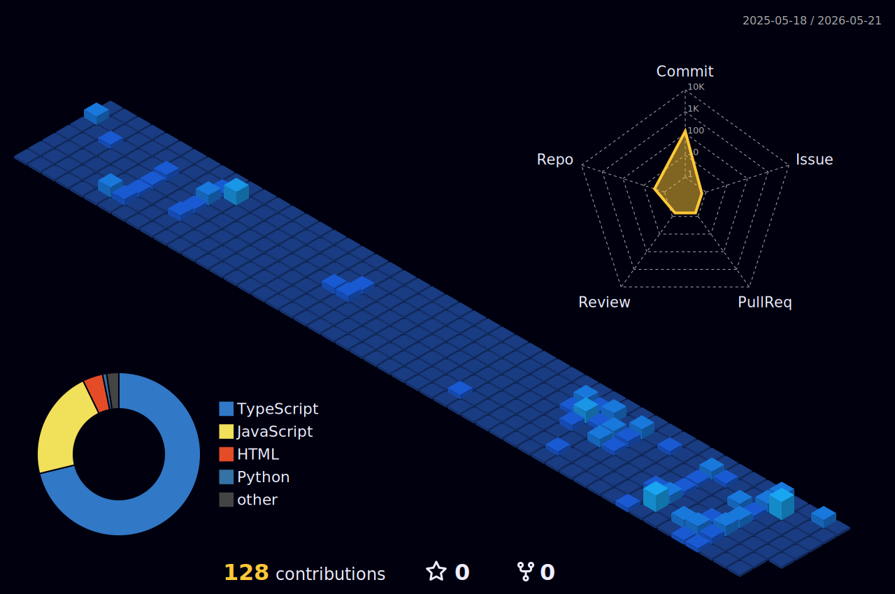

<!-- Typing SVG animado -->

<!-- Badges de presentación -->

[🇪🇸 Leer en Español](./README.es.md)

---

## About me

I'm a web developer, passionate about turning ideas into functional products, currently at an intermediate frontend and jr backend development level.

Software Development bachelor's student at UTP (Panama), focused on building my professional profile in web development while aiming towards data science and machine learning.

- Building projects in public to get my first freelance clients.
- Learning **TypeScript** and diving deep into Next.js, **Node.js**, **Express**, **PostgreSQL** and Django.
- Medium-term goal: Learn about AI and Data Science.
- Long-term goal: Master the field of software engineering.
- I like to read and write in Spanish, and experiment and build in English.
- Involved in my community, always willing to help.

---

## Tech Stack

<!-- skillicons.dev — adjust icons according to what you use -->

**Frontend**

**Backend & Databases**

**Tools**

**Learning (short-term)**

**Learning (long-term)**

---

## GitHub Stats

---

## Connect with me

---

  ⌨️ "Code is poetry that the machine can read." — building in public, one commit at a time.

